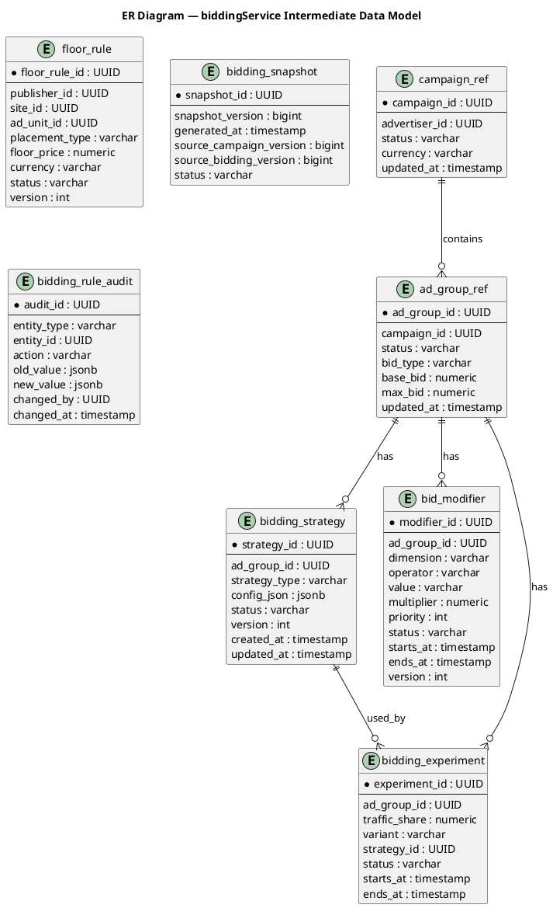

# 1. Цель промежуточного решения через 3 месяца

За 3 месяца нецелесообразно и рискованно полностью переписать RTB-платформу в микросервисы. Поэтому промежуточное решение должно быть эволюционным:

- выделить из монолита наиболее latency-sensitive часть — `biddingService`;
- убрать расчёт ставок из `Auction Engine`;
- исключить синхронные обращения к PostgreSQL из hot path расчёта ставок;
- дать возможность горизонтально масштабировать расчёт ставок отдельно от монолита;
- подготовить основу для будущей целевой архитектуры через год;
- обеспечить подключение новой DSP-площадки и рост до `18 000 RPS`;
- удержать `P95 latency ≤ 100 ms` для аукционного пути.

# 2. Роль `biddingService` в промежуточной архитектуре

`biddingService` — отдельный сервис, отвечающий за расчёт эффективной ставки для кандидатов рекламного аукциона.

Он выделяется из текущего `Auction Engine`, но на первом этапе не забирает на себя весь аукцион. `Auction Engine` остаётся в монолите и продолжает:

- принимать список кандидатов от `Ad Server`;
- вызывать `biddingService` для расчёта `effective bid`;
- применять механику аукциона;
- выбирать победителя;
- передавать победителя в `Delivery Service`.

Новая граница ответственности:

```text
Auction Engine:
  orchestration auction flow
  candidate filtering
  auction mechanics
  winner selection

biddingService:
  bid calculation
  bid modifiers
  floor price rules
  bidding strategy
  pacing-aware adjustment
  fallback bidding logic
```

# 3. Границы `biddingService`

## 3.1. Что входит в `biddingService`

`biddingService` отвечает за:

### Расчёт `effective bid`

- получение базовой ставки;
- применение bid modifiers;
- применение floor price;
- применение bidding strategy;
- корректировка ставки с учётом pacing/budget signals.

### Работу со стратегиями ставок

- manual CPC/CPM;
- fixed bid;
- simple pacing adjustment;
- в будущем — CPA/ROAS/ML-based bidding.

### Работу с bid modifiers

- geo modifier;
- device modifier;
- site/app modifier;
- placement modifier;
- time-of-day modifier;
- segment modifier.

### Проверку ограничений

- min bid;
- max bid;
- floor price;
- campaign/ad group limits;
- currency normalization, если требуется.

### Кэширование данных для hot path

- активные кампании;
- base bids;
- bid modifiers;
- стратегии ставок;
- floor rules;
- lightweight pacing state.

### События и аудит

- публикация событий о рассчитанных ставках;
- логирование причин no-bid;
- технические метрики latency/error rate.

# 4. Промежуточная C4 Container-диаграмма через 3 месяца

Диаграмма состояния после выделения `biddingService`.

```plantuml
@startuml
!include https://raw.githubusercontent.com/plantuml-stdlib/C4-PlantUML/master/C4_Container.puml

LAYOUT_WITH_LEGEND()
LAYOUT_LEFT_RIGHT()

title C4 Container Diagram — AdScale Intermediate Architecture in 3 Months

Person(advertiser, "Рекламодатель", "Управляет кампаниями, бюджетами и ставками через личный кабинет")
Person_Ext(endUser, "Пользователь сайта/приложения", "Просматривает рекламу, кликает по баннерам")

System_Ext(dspPartnerOld, "Текущие DSP/Ad Exchanges", "Bid requests / responses")
System_Ext(dspPartnerNew, "Новый DSP-партнёр", "Bid requests / responses по OpenRTB")
System_Ext(paymentGateway, "Платёжный шлюз", "Обработка пополнения бюджетов")

System_Boundary(monolith, "AdScale Monolith") {

    Container(adServer, "Ad Server", "C++ / Go", "Принимает bid requests, определяет пользователя, подбирает кандидатов")

    Container(auctionEngine, "Auction Engine", "C++", "Оркестрация аукциона, вызов biddingService, выбор победителя")

    Container(deliveryService, "Delivery Service", "Node.js", "Формирует HTML/JS/OpenRTB response")

    Container(statsService, "Statistics Service", "Python", "Сбор кликов и показов. На промежуточном этапе запись переводится в очередь/буфер")

    Container(financialService, "Financial Service", "Go", "Финансы, балансы, списания, счета")

    Container(analyticsService, "Analytics Service", "Python", "Отчёты и аналитика. Ограничивается доступ к production-БД")

    Container(adCabinet, "Advertiser Dashboard", "Node.js + JavaScript", "UI управления кампаниями, ставками и отчётами")
}

System_Boundary(biddingBoundary, "New Extracted Service") {
    Container(biddingService, "biddingService", "Go / C++", "Расчёт effective bid, bid modifiers, стратегии ставок, floor price, pacing-aware adjustment")
}

System_Boundary(dataLayer, "Data Layer") {
    ContainerDb(postgres, "PostgreSQL Primary", "PostgreSQL", "Текущая основная БД монолита")
    ContainerDb(readReplica, "PostgreSQL Read Replica", "PostgreSQL", "Реплика для аналитики и чтений вне hot path")
    ContainerDb(biddingDb, "Bidding DB", "PostgreSQL", "Конфигурация biddingService: стратегии, modifiers, версии правил")
    Container(servingCache, "Bidding Serving Cache", "Redis Cluster", "Горячие данные ставок: base bids, modifiers, strategies, floor rules")
}

System_Boundary(asyncLayer, "Async / Buffering Layer") {
    Container(eventQueue, "Event Queue", "Kafka / Redpanda / RabbitMQ", "Буферизация событий показов, кликов, bid events, campaign changes") 
    Container(cacheSyncWorker, "Bidding Cache Sync Worker", "Go", "Загружает изменения ставок/кампаний из PostgreSQL/Bidding DB в Redis")
}

Rel(dspPartnerOld, adServer, "Bid requests / responses", "HTTPS / OpenRTB")
Rel(dspPartnerNew, adServer, "Bid requests / responses", "HTTPS / OpenRTB")
Rel(endUser, deliveryService, "Impressions / clicks", "HTTPS")
Rel(advertiser, adCabinet, "Управляет кампаниями", "HTTPS")
Rel(adCabinet, paymentGateway, "Пополнение бюджета", "HTTPS / REST")

Rel(adServer, auctionEngine, "Передаёт кандидатов", "Internal call")
Rel(auctionEngine, biddingService, "Запрашивает effective bids для кандидатов", "gRPC / HTTP")
Rel(auctionEngine, deliveryService, "Передаёт winner", "Internal call")

Rel(deliveryService, statsService, "Регистрирует показы/клики", "Internal call")
Rel(statsService, eventQueue, "Публикует impression/click events", "Async")
Rel(eventQueue, postgres, "Пакетная запись событий / consumers", "Async batch")

Rel(adCabinet, financialService, "Финансы", "Internal call")
Rel(adCabinet, analyticsService, "Отчёты", "Internal call")

Rel(adServer, postgres, "Legacy reads для таргетинга", "SQL")
Rel(auctionEngine, postgres, "Минимальные legacy reads, постепенно сокращаются", "SQL")
Rel(financialService, postgres, "Финансовые транзакции", "SQL")
Rel(adCabinet, postgres, "CRUD кампаний и ставок", "SQL")

Rel(analyticsService, readReplica, "Тяжёлые read-запросы", "SQL")
Rel(readReplica, postgres, "Streaming replication", "PostgreSQL replication")

Rel(biddingService, servingCache, "Hot path read: base bids, modifiers, strategies", "Redis")
Rel(biddingService, biddingDb, "Admin/config path only, не в hot path", "SQL")
Rel(biddingService, eventQueue, "Публикует bid_calculated/no_bid events", "Async")

Rel(cacheSyncWorker, postgres, "Читает campaign/base bid changes", "SQL / polling or CDC-lite")
Rel(cacheSyncWorker, biddingDb, "Читает bidding strategies/modifiers", "SQL")
Rel(cacheSyncWorker, servingCache, "Обновляет serving snapshots", "Redis")
Rel(cacheSyncWorker, eventQueue, "Публикует cache_refresh events", "Async")

Rel(paymentGateway, financialService, "Payment callbacks", "HTTPS")

note right of biddingService
  Новая граница:
  - расчёт effective bid
  - bid modifiers
  - strategy rules
  - floor price
  - pacing-aware adjustment

  Не выбирает winner.
  Не списывает деньги.
  Не читает PostgreSQL в hot path.
end note

note right of servingCache
  Главный источник данных biddingService
  в RTB hot path.

  Требования:
  - p95 read latency 1-3 ms
  - preloaded active campaigns
  - fallback на stale cache
  - TTL/versioning
end note

note bottom of eventQueue
  Очередь нужна, чтобы разделить:
  - critical RTB path
  - non-critical statistics/events path

  Это снижает write pressure на PostgreSQL.
end note

note right of readReplica
  Аналитика уводится с primary PostgreSQL,
  чтобы тяжёлые запросы не блокировали
  auction/bidding path.
end note

legend right
  <#00AA00> Intermediate target in 3 months
  <#00AA00> Support at least 18 000 RPS
  <#00AA00> P95 auction latency ≤ 100 ms
  <#00AA00> biddingService horizontally scalable

  <#0088FF> New: extracted biddingService
  <#0088FF> New: Redis serving cache
  <#0088FF> New: event queue for write buffering
  <#0088FF> New: read replica for analytics

  <#FFAA00> Critical path:
  DSP → Ad Server → Auction Engine → biddingService
  → Auction Engine → Delivery Service → DSP

  <#888888> Legacy monolith remains
endlegend

@enduml
```

# 5. API `biddingService`

На промежуточном этапе API должен быть минимальным, быстрым и стабильным. Основной hot path — синхронный вызов из `Auction Engine`.

Рекомендуемый транспорт:

- gRPC для минимальной latency и строгих контрактов;
- HTTP/JSON можно оставить как fallback/debug/admin API;
- timeout на вызов `biddingService`: `10–20 ms`;
- deadline должен прокидываться из `Auction Engine`.

## 5.1. Основной API: `CalculateBids`

### Назначение

Рассчитать `effective bid` для списка кандидатов в рамках одного bid request.

### gRPC

```proto
syntax = "proto3";

package adscale.bidding.v1;

service BiddingService {
  rpc CalculateBids(CalculateBidsRequest) returns (CalculateBidsResponse);
  rpc GetBidDebug(GetBidDebugRequest) returns (GetBidDebugResponse);
  rpc HealthCheck(HealthCheckRequest) returns (HealthCheckResponse);
}
```

### `CalculateBidsRequest`

```proto
message CalculateBidsRequest {
  string request_id = 1;
  string auction_id = 2;
  int64 request_time_ms = 3;

  Deadline deadline = 4;
  UserContext user = 5;
  PlacementContext placement = 6;

  repeated BidCandidate candidates = 7;

  string currency = 8;
  bool debug = 9;
}

message Deadline {
  int64 timeout_ms = 1;
  int64 deadline_unix_ms = 2;
}

message UserContext {
  string user_id = 1;
  string country = 2;
  string region = 3;
  string city = 4;
  string device_type = 5;
  string os = 6;
  string browser = 7;
  repeated string segments = 8;
}

message PlacementContext {
  string site_id = 1;
  string app_id = 2;
  string publisher_id = 3;
  string ad_unit_id = 4;
  string placement_type = 5;
  double floor_price = 6;
  string floor_currency = 7;
}

message BidCandidate {
  string campaign_id = 1;
  string ad_group_id = 2;
  string creative_id = 3;

  double base_bid = 4;
  string bid_type = 5; // CPM, CPC, CPA

  map<string, string> attributes = 6;
}
```

### `CalculateBidsResponse`

```proto
message CalculateBidsResponse {
  string request_id = 1;
  string auction_id = 2;

  repeated CalculatedBid bids = 3;

  BiddingStatus status = 4;
  int64 processing_time_ms = 5;
}

message CalculatedBid {
  string campaign_id = 1;
  string ad_group_id = 2;
  string creative_id = 3;

  double effective_bid = 4;
  string currency = 5;

  BidDecision decision = 6;
  repeated string applied_rules = 7;
  string reason = 8;
}

enum BidDecision {
  BID_DECISION_UNSPECIFIED = 0;
  BID = 1;
  NO_BID = 2;
}

enum BiddingStatus {
  BIDDING_STATUS_UNSPECIFIED = 0;
  OK = 1;
  PARTIAL = 2;
  TIMEOUT = 3;
  ERROR = 4;
}
```

## 5.2. Пример HTTP API для hot path

Если на первом этапе gRPC внедрить сложно, можно использовать HTTP/JSON с keep-alive.

```http
POST /v1/bids:calculate
Content-Type: application/json
X-Request-Id: req-123
X-Deadline-Ms: 20
```

Пример запроса:

```json
{
  "requestId": "req-123",
  "auctionId": "auc-987",
  "requestTimeMs": 1735000000000,
  "deadline": {
    "timeoutMs": 20,
    "deadlineUnixMs": 1735000000020
  },
  "user": {
    "userId": "u-42",
    "country": "DE",
    "deviceType": "mobile",
    "os": "ios",
    "segments": ["sports", "travel"]
  },
  "placement": {
    "siteId": "site-10",
    "publisherId": "pub-5",
    "adUnitId": "banner-top",
    "placementType": "display",
    "floorPrice": 1.2,
    "floorCurrency": "USD"
  },
  "candidates": [
    {
      "campaignId": "cmp-1",
      "adGroupId": "ag-1",
      "creativeId": "cr-1",
      "baseBid": 1.5,
      "bidType": "CPM"
    }
  ],
  "currency": "USD"
}
```

Пример ответа:

```json
{
  "requestId": "req-123",
  "auctionId": "auc-987",
  "status": "OK",
  "processingTimeMs": 4,
  "bids": [
    {
      "campaignId": "cmp-1",
      "adGroupId": "ag-1",
      "creativeId": "cr-1",
      "effectiveBid": 1.72,
      "currency": "USD",
      "decision": "BID",
      "appliedRules": [
        "base_bid",
        "geo_modifier:DE:1.1",
        "device_modifier:mobile:1.05",
        "floor_price_passed"
      ],
      "reason": "OK"
    }
  ]
}
```

## 5.3. Возможные no-bid причины

```text
CAMPAIGN_INACTIVE
AD_GROUP_INACTIVE
BASE_BID_MISSING
BELOW_FLOOR_PRICE
BUDGET_LIMIT_REACHED
PACING_LIMIT_REACHED
INVALID_CURRENCY
STRATEGY_DISABLED
CACHE_MISS
TIMEOUT
INTERNAL_ERROR
```

# 6. Административный API `biddingService`

На промежуточном этапе можно оставить CRUD ставок и стратегий в монолите, но `biddingService` должен иметь API для:

- проверки состояния;
- принудительного обновления кэша;
- просмотра версии конфигурации;
- debug-расчёта ставки.

## 6.1. Health Check

```http
GET /health
```

Ответ:

```json
{
  "status": "UP",
  "version": "1.3.0",
  "cache": {
    "status": "UP",
    "lastRefreshAt": "2026-06-21T10:00:00Z",
    "snapshotVersion": 34811
  },
  "db": {
    "status": "UP"
  }
}
```

## 6.2. Readiness

```http
GET /ready
```

Ответ:

```json
{
  "ready": true,
  "requiredCacheLoaded": true,
  "activeCampaignsLoaded": true,
  "snapshotVersion": 34811
}
```

## 6.3. Cache refresh

```http
POST /admin/cache/refresh
```

Ответ:

```json
{
  "status": "ACCEPTED",
  "refreshJobId": "refresh-20260621-001"
}
```

## 6.4. Config version

```http
GET /admin/config/version
```

Ответ:

```json
{
  "snapshotVersion": 34811,
  "biddingRulesVersion": 902,
  "modifiersVersion": 771,
  "lastUpdatedAt": "2026-06-21T10:00:00Z"
}
```

# 7. Зависимости `biddingService`

## 7.1. Синхронные зависимости в hot path

В hot path у `biddingService` должна быть только одна обязательная зависимость:

```text
biddingService → Redis / Bidding Serving Cache
```

Причина:

- PostgreSQL не выдерживает дополнительные синхронные чтения на `18 000 RPS`;
- текущий bottleneck — именно sync DB access;
- Redis/Aerospike даёт latency в единицы миллисекунд;
- сервис можно масштабировать горизонтально.

## 7.2. Синхронные зависимости вне hot path

```text
biddingService → Bidding DB
```

Используется только для:

- административных операций;
- отладки;
- сверки версий;
- fallback при ручной диагностике.

В RTB-пути обращаться в PostgreSQL нельзя.

## 7.3. Асинхронные зависимости

```text
biddingService → Event Queue
```

Публикует события:

- `bid_calculated`;
- `bid_no_bid`;
- `bid_timeout`;
- `bid_error`;
- `bidding_cache_miss`;
- `bidding_strategy_applied`.

## 7.4. Входящие зависимости

```text
Auction Engine → biddingService
```

`Auction Engine` вызывает `biddingService` для расчёта ставок.

```text
Cache Sync Worker → Redis
```

Worker поставляет в Redis данные, которые затем читает `biddingService`.

```text
Ad Cabinet / Monolith → PostgreSQL / Bidding DB
```

Пока UI остаётся в монолите, изменения ставок и стратегий продолжают происходить через существующий рекламный кабинет.

# 8. Контракты событий `biddingService`

## 8.1. `bid_calculated`

```json
{
  "eventId": "evt-001",
  "eventType": "bid_calculated",
  "occurredAt": "2026-06-21T10:00:00.123Z",
  "requestId": "req-123",
  "auctionId": "auc-987",
  "campaignId": "cmp-1",
  "adGroupId": "ag-1",
  "creativeId": "cr-1",
  "baseBid": 1.5,
  "effectiveBid": 1.72,
  "currency": "USD",
  "appliedRules": [
    "geo_modifier",
    "device_modifier",
    "floor_price"
  ],
  "strategyId": "strategy-1",
  "strategyVersion": 7,
  "processingTimeMs": 4
}
```

## 8.2. `bid_no_bid`

```json
{
  "eventId": "evt-002",
  "eventType": "bid_no_bid",
  "occurredAt": "2026-06-21T10:00:00.124Z",
  "requestId": "req-123",
  "auctionId": "auc-987",
  "campaignId": "cmp-2",
  "adGroupId": "ag-2",
  "creativeId": "cr-2",
  "reason": "BELOW_FLOOR_PRICE",
  "baseBid": 0.8,
  "floorPrice": 1.2,
  "currency": "USD",
  "processingTimeMs": 3
}
```

## 8.3. `bidding_cache_miss`

```json
{
  "eventId": "evt-003",
  "eventType": "bidding_cache_miss",
  "occurredAt": "2026-06-21T10:00:00.124Z",
  "requestId": "req-123",
  "campaignId": "cmp-3",
  "adGroupId": "ag-3",
  "missingKey": "bid_config:ag-3",
  "fallbackApplied": true
}
```

# 9. Модель данных `biddingService`

На промежуточном этапе есть два уровня хранения:

- `Bidding DB` — source of truth для стратегий и modifiers.
- `Serving Cache` — оптимизированные данные для RTB hot path.

Базовые кампании и базовые ставки пока могут оставаться в общей PostgreSQL монолита, но для `biddingService` они должны попадать в cache через `Cache Sync Worker`.

## 9.1. Логическая модель данных

Основные сущности:

```text
Campaign
  └── AdGroup
        ├── BaseBid
        ├── BiddingStrategy
        ├── BidModifier[]
        └── FloorRule[]
```

Дополнительные сущности:

```text
BiddingExperiment
BiddingSnapshot
BiddingRuleAudit
```

## 9.2. ER-диаграмма модели `biddingService`



## 9.3. Таблицы `Bidding DB`

### `campaign_ref`

На промежуточном этапе это может быть read-model, синхронизированная из монолитной БД.

```sql
CREATE TABLE campaign_ref (
    campaign_id UUID PRIMARY KEY,
    advertiser_id UUID NOT NULL,
    status VARCHAR(32) NOT NULL,
    currency VARCHAR(3) NOT NULL,
    updated_at TIMESTAMP NOT NULL
);
```

### `ad_group_ref`

```sql
CREATE TABLE ad_group_ref (
    ad_group_id UUID PRIMARY KEY,
    campaign_id UUID NOT NULL REFERENCES campaign_ref(campaign_id),
    status VARCHAR(32) NOT NULL,
    bid_type VARCHAR(16) NOT NULL,
    base_bid NUMERIC(18,6) NOT NULL,
    max_bid NUMERIC(18,6),
    updated_at TIMESTAMP NOT NULL
);

CREATE INDEX idx_ad_group_ref_campaign_id
ON ad_group_ref(campaign_id);
```

### `bidding_strategy`

```sql
CREATE TABLE bidding_strategy (
    strategy_id UUID PRIMARY KEY,
    ad_group_id UUID NOT NULL REFERENCES ad_group_ref(ad_group_id),
    strategy_type VARCHAR(32) NOT NULL,
    config_json JSONB NOT NULL,
    status VARCHAR(32) NOT NULL,
    version INT NOT NULL DEFAULT 1,
    created_at TIMESTAMP NOT NULL,
    updated_at TIMESTAMP NOT NULL
);

CREATE INDEX idx_bidding_strategy_ad_group_id
ON bidding_strategy(ad_group_id);
```

Пример `config_json`:

```json
{
  "type": "MANUAL_CPM",
  "maxBid": 3.5,
  "minBid": 0.1,
  "pacing": {
    "enabled": true,
    "mode": "EVEN",
    "aggressiveness": 0.8
  }
}
```

### `bid_modifier`

```sql
CREATE TABLE bid_modifier (
    modifier_id UUID PRIMARY KEY,
    ad_group_id UUID NOT NULL REFERENCES ad_group_ref(ad_group_id),

    dimension VARCHAR(32) NOT NULL,
    operator VARCHAR(16) NOT NULL,
    value VARCHAR(128) NOT NULL,

    multiplier NUMERIC(10,4) NOT NULL,
    priority INT NOT NULL DEFAULT 100,

    status VARCHAR(32) NOT NULL,
    starts_at TIMESTAMP,
    ends_at TIMESTAMP,

    version INT NOT NULL DEFAULT 1
);

CREATE INDEX idx_bid_modifier_ad_group_id
ON bid_modifier(ad_group_id);

CREATE INDEX idx_bid_modifier_dimension_value
ON bid_modifier(dimension, value);
```

Примеры `dimensions`:

```text
GEO_COUNTRY
GEO_REGION
DEVICE_TYPE
OS
BROWSER
SITE
APP
PUBLISHER
AD_UNIT
HOUR_OF_DAY
USER_SEGMENT
```

### `floor_rule`

```sql
CREATE TABLE floor_rule (
    floor_rule_id UUID PRIMARY KEY,

    publisher_id UUID,
    site_id UUID,
    ad_unit_id UUID,
    placement_type VARCHAR(32),

    floor_price NUMERIC(18,6) NOT NULL,
    currency VARCHAR(3) NOT NULL,

    status VARCHAR(32) NOT NULL,
    version INT NOT NULL DEFAULT 1
);

CREATE INDEX idx_floor_rule_lookup
ON floor_rule(publisher_id, site_id, ad_unit_id, placement_type);
```

### `bidding_experiment`

```sql
CREATE TABLE bidding_experiment (
    experiment_id UUID PRIMARY KEY,
    ad_group_id UUID NOT NULL REFERENCES ad_group_ref(ad_group_id),
    traffic_share NUMERIC(5,4) NOT NULL,
    variant VARCHAR(64) NOT NULL,
    strategy_id UUID REFERENCES bidding_strategy(strategy_id),
    status VARCHAR(32) NOT NULL,
    starts_at TIMESTAMP,
    ends_at TIMESTAMP
);

CREATE INDEX idx_bidding_experiment_ad_group_id
ON bidding_experiment(ad_group_id);
```

### `bidding_snapshot`

```sql
CREATE TABLE bidding_snapshot (
    snapshot_id UUID PRIMARY KEY,
    snapshot_version BIGINT NOT NULL UNIQUE,
    generated_at TIMESTAMP NOT NULL,
    source_campaign_version BIGINT,
    source_bidding_version BIGINT,
    status VARCHAR(32) NOT NULL
);
```

### `bidding_rule_audit`

```sql
CREATE TABLE bidding_rule_audit (
    audit_id UUID PRIMARY KEY,

    entity_type VARCHAR(64) NOT NULL,
    entity_id UUID NOT NULL,
    action VARCHAR(32) NOT NULL,

    old_value JSONB,
    new_value JSONB,

    changed_by UUID,
    changed_at TIMESTAMP NOT NULL
);

CREATE INDEX idx_bidding_rule_audit_entity
ON bidding_rule_audit(entity_type, entity_id);
```

# 10. Модель Serving Cache

В hot path `biddingService` читает не из PostgreSQL, а из Redis.

## 10.1. Ключи Redis

### Конфигурация ad group

```text
bidcfg:adgroup:{ad_group_id}
```

Пример значения:

```json
{
  "adGroupId": "ag-1",
  "campaignId": "cmp-1",
  "status": "ACTIVE",
  "bidType": "CPM",
  "baseBid": 1.5,
  "maxBid": 3.0,
  "currency": "USD",
  "strategy": {
    "strategyId": "str-1",
    "type": "MANUAL_CPM",
    "version": 7,
    "config": {
      "minBid": 0.1,
      "maxBid": 3.0,
      "pacingEnabled": true
    }
  },
  "modifiersVersion": 12,
  "snapshotVersion": 34811
}
```

### Модификаторы ad group

```text
bidmod:adgroup:{ad_group_id}
```

```json
[
  {
    "dimension": "GEO_COUNTRY",
    "operator": "EQ",
    "value": "DE",
    "multiplier": 1.1,
    "priority": 10
  },
  {
    "dimension": "DEVICE_TYPE",
    "operator": "EQ",
    "value": "mobile",
    "multiplier": 1.05,
    "priority": 20
  }
]
```

### Floor rules

```text
floor:placement:{publisher_id}:{site_id}:{ad_unit_id}
```

```json
{
  "floorPrice": 1.2,
  "currency": "USD",
  "version": 31
}
```

### Snapshot version

```text
bidding:snapshot:current
```

```json
{
  "snapshotVersion": 34811,
  "generatedAt": "2026-06-21T10:00:00Z"
}
```

## 10.2. Требования к кэшу

| Параметр | Требование |
|---|---|
| Тип | Redis Cluster минимум 3 master + replicas |
| Latency | p95 ≤ 3 ms |
| Availability | degrade gracefully при частичной недоступности |
| Data type | JSON/string или hash |
| TTL | 5–30 минут для горячих ключей |
| Warmup | обязательный перед вводом инстанса `biddingService` в ready |
| Fallback | stale snapshot или base bid из request |
| Invalidation | через `cacheSyncWorker` |
| Versioning | `snapshotVersion` в каждом объекте |

# 11. Нефункциональные требования к `biddingService`

## 11.1. Производительность

| Метрика | Требование |
|---|---|
| Входящий поток | `18 000 RPS` на платформу |
| Вызовы `biddingService` | до `18 000 RPS`, возможно больше при batch candidates |
| P95 latency `biddingService` | ≤ 10 ms |
| P99 latency `biddingService` | ≤ 20 ms |
| Timeout | 10–20 ms |
| Error rate | ≤ 0.1% |
| CPU saturation | ≤ 70% на пике |

# 12. Изменения в `Auction Engine`

После выделения сервиса `Auction Engine` должен:

- перестать самостоятельно рассчитывать modifiers/strategies;
- формировать `CalculateBidsRequest`;
- передавать batch candidates;
- задавать deadline;
- обрабатывать `OK`, `PARTIAL`, `TIMEOUT`, `ERROR`;
- иметь feature flag:

```text
use_external_bidding_service=true/false
```

- сохранять старый путь как rollback.

Пример логики:

```python
if featureFlag.useExternalBiddingService:
    response = biddingService.CalculateBids(candidates, deadline=20ms)

    if response.status in [OK, PARTIAL]:
        use response.bids
    else:
        use legacy embedded bidding calculation
else:
    use legacy embedded bidding calculation
```

# 13. Миграционный план на 3 месяца

## Месяц 1 — подготовка и контракт

- зафиксировать текущую bidding-логику в `Auction Engine`;
- покрыть её regression-тестами;
- выделить чистый модуль расчёта ставок;
- описать gRPC/HTTP API;
- подготовить Redis Cluster;
- подготовить `Bidding DB`;
- реализовать базовую схему данных;
- добавить метрики latency/error rate в текущий аукцион.

## Месяц 2 — реализация `biddingService`

- реализовать stateless `biddingService`;
- реализовать `CalculateBids`;
- реализовать `Cache Sync Worker`;
- загрузить active campaigns/base bids/modifiers в Redis;
- добавить fallback на legacy bidding;
- добавить публикацию bid events в очередь;
- провести shadow traffic:
  - `Auction Engine` вызывает `biddingService`;
  - результат сравнивается со старым расчётом;
  - победитель пока выбирается старой логикой.

## Месяц 3 — production rollout

- включить `biddingService` для 5% трафика;
- затем 25%, 50%, 100%;
- подключить нового DSP-партнёра;
- вынести аналитику на read replica;
- перевести запись кликов/показов в очередь или хотя бы batch writes;
- настроить алерты;
- провести нагрузочное тестирование на `18 000+ RPS`;
- подготовить rollback plan.

# 14. Метрики и мониторинг

## 14.1. Технические метрики `biddingService`

```text
bidding_requests_total
bidding_request_duration_ms
bidding_candidates_per_request
bidding_calculated_total
bidding_no_bid_total
bidding_errors_total
bidding_timeouts_total
bidding_cache_hit_ratio
bidding_cache_miss_total
bidding_redis_latency_ms
bidding_fallback_used_total
bidding_partial_response_total
```

## 14.2. Бизнес-метрики

```text
bid_rate
no_bid_rate
win_rate
average_effective_bid
average_bid_floor_gap
revenue_per_mille
campaign_spend_rate
budget_limited_campaigns
```

## 14.3. SLO для промежуточного решения

| SLO | Цель |
|---|---|
| Auction P95 latency | ≤ 100 ms |
| `biddingService` P95 latency | ≤ 10 ms |
| `biddingService` availability | ≥ 99.5% |
| Redis P95 latency | ≤ 3 ms |
| Cache hit ratio | ≥ 99% |
| Error rate | ≤ 0.1% |
| `18 000 RPS` load test | Успешно |

# 15. Итоговая граница владения `biddingService`

## `biddingService` владеет

- стратегиями расчёта ставок;
- bid modifiers;
- правилами effective bid;
- floor price handling внутри расчёта;
- bidding experiments;
- audit изменений bidding rules;
- serving cache-моделью ставок;
- событиями `bid_calculated` и `bid_no_bid`.

## `biddingService` не владеет

- кампаниями как lifecycle-сущностью;
- рекламным кабинетом;
- деньгами и балансами;
- списаниями;
- выбором победителя;
- креативами;
- таргетингом;
- аналитическими отчётами;
- событиями кликов/показов как source of truth.

# 16. Вывод

Через 3 месяца оптимальное промежуточное решение — не полная микросервисная трансформация, а выделение `biddingService` как stateless latency-critical сервиса с чтением из Redis Serving Cache и fallback на старую логику монолита.

Это позволяет:

- снизить нагрузку на `Auction Engine`;
- убрать синхронные DB-чтения из расчёта ставок;
- масштабировать bidding независимо;
- разделить critical и non-critical потоки;
- подготовить архитектурную основу для целевого состояния через год;
- безопасно подключить нового DSP-партнёра;
- выдержать `18 000 RPS` и удержать `P95 ≤ 100 ms`.
```
