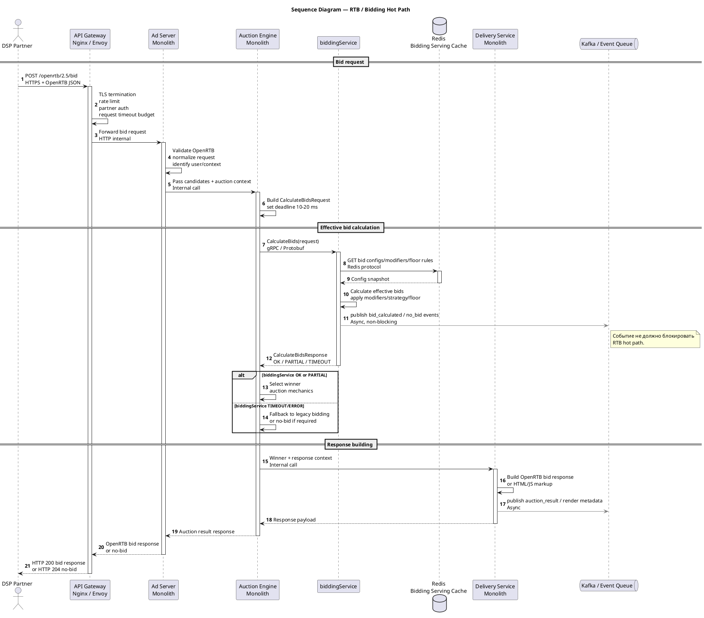
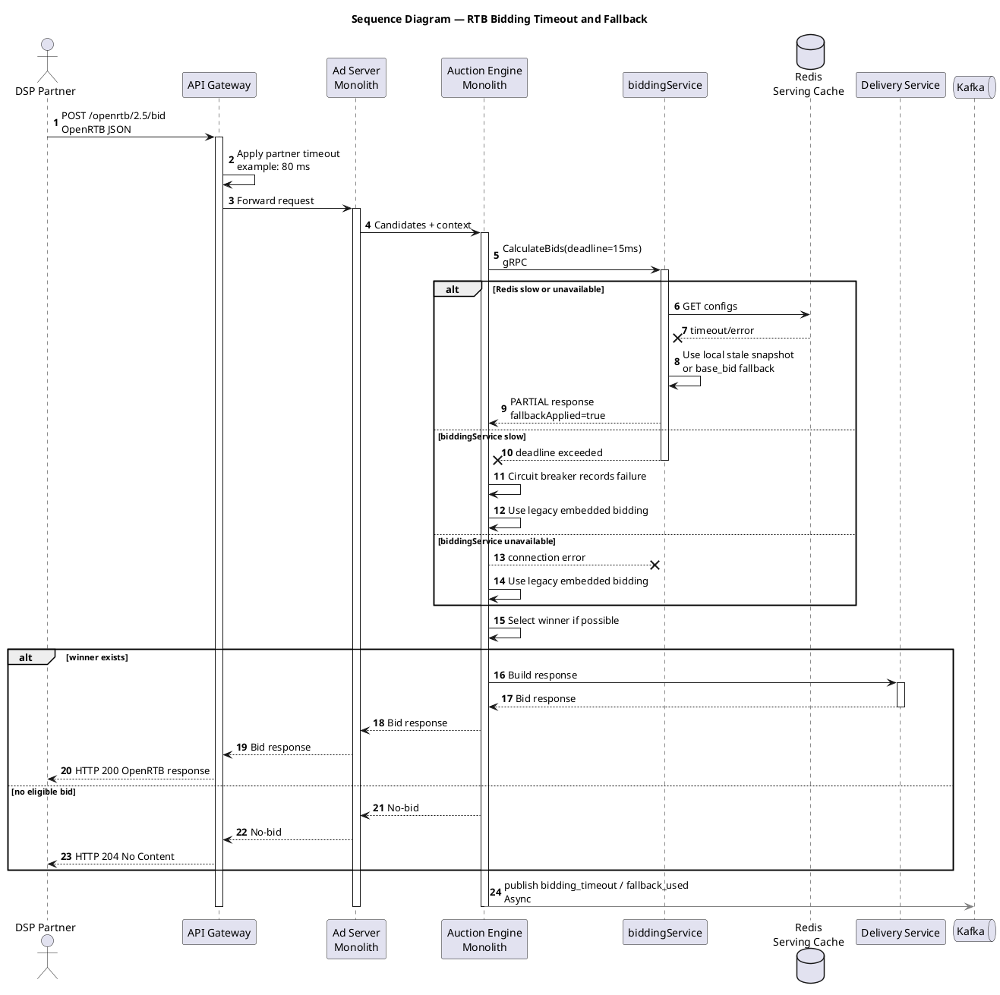
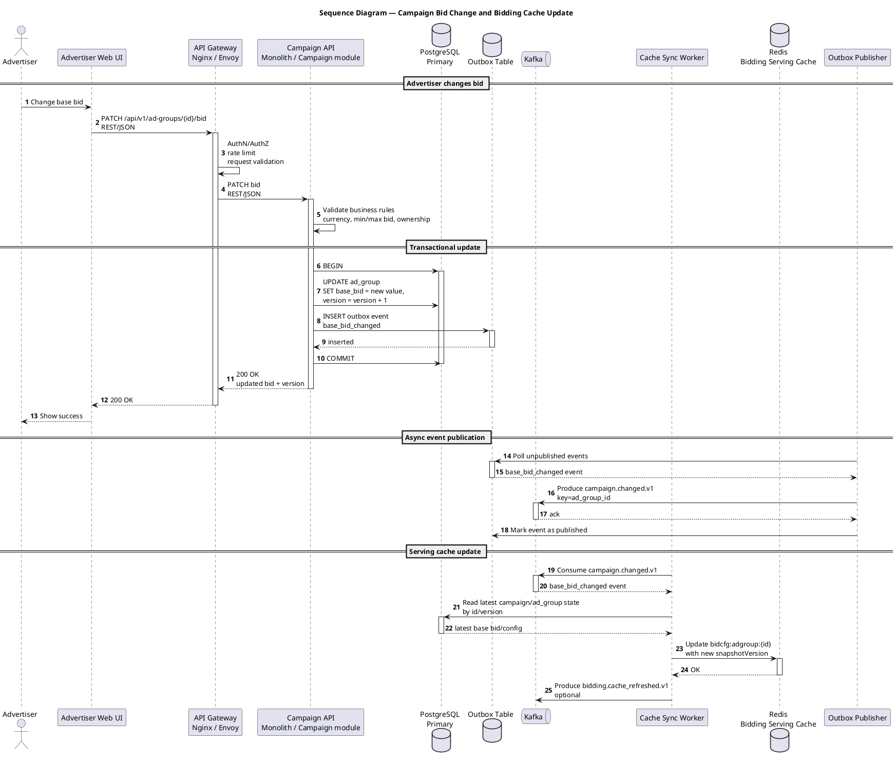
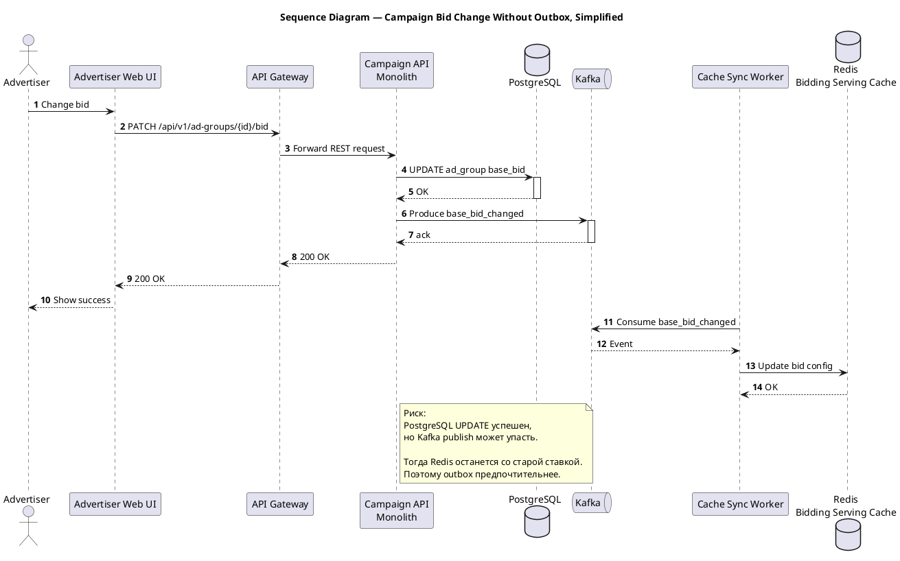
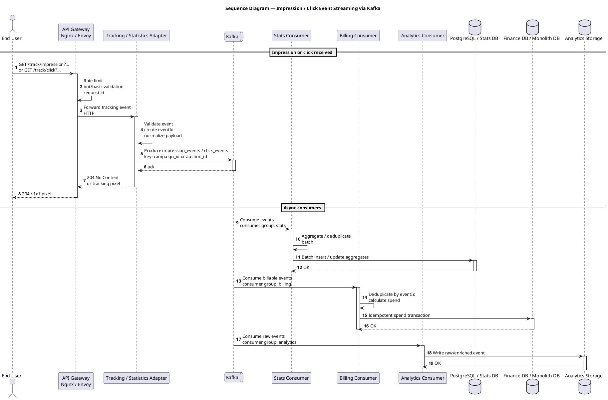
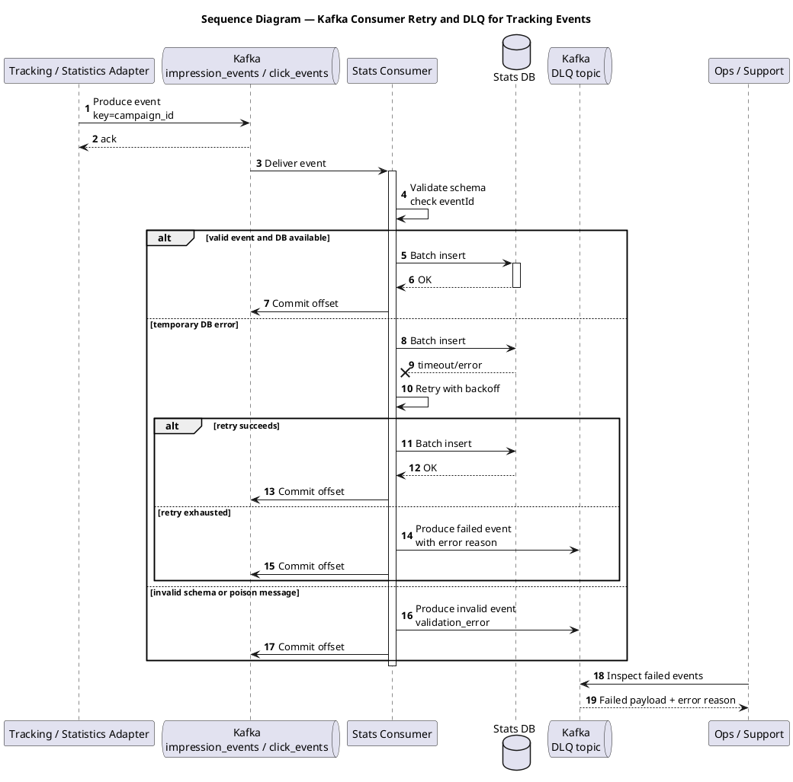
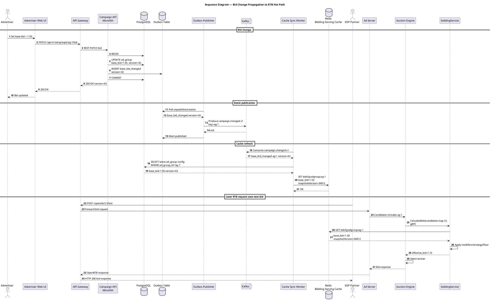

## sequence-диаграммы

1. RTB / Bidding hot path  
2. Campaign management / изменение ставки  
3. Clicks & impressions / потоковая обработка событий через Kafka  

---

# 1. RTB / Bidding hot path

---

# 2. RTB / Bidding hot path с timeout и fallback

Эта диаграмма отдельно показывает критичный сценарий деградации `biddingService`.

---

# 3. Campaign management / изменение ставки

Поток для изменения ставки рекламодателем через кабинет.  
Основной API — REST. После изменения публикуется событие в Kafka, а `Cache Sync Worker` обновляет Redis для `biddingService`.

---

# 4. Campaign management без Outbox, упрощённый вариант

Если outbox не успевают внедрить за 3 месяца, можно сделать проще, но это менее надёжно.

---

# 5. Clicks & impressions через Kafka

Поток событий кликов и показов.  
Цель — убрать прямую синхронную запись в PostgreSQL из request path.

---

# 6. Clicks & impressions с ошибкой consumer и retry/DLQ

---

# 7. Полный промежуточный поток: изменение ставки влияет на RTB

Эта диаграмма показывает связь между Campaign REST API, Kafka, Redis cache и последующим использованием новой ставки в `biddingService`.

