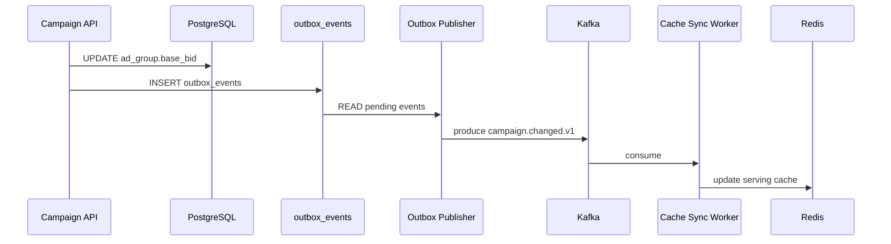

## Проектирование взаимодействия для промежуточного решения **AdScale**

---

### 0. Контекст и цель

Промежуточное решение проектируется на **горизонт 3 месяца**. Полная переработка монолита невозможна, поэтому основная цель — безопасно выделить `biddingService`, подключить нового DSP‑партнёра и выдержать рост нагрузки до **18 000 RPS** без деградации SLA.

**Ключевые целевые показатели**

| KPI | Требования |
|-----|------------|
| Поддержка нового DSP‑партнёра | – |
| RTB / акционный путь | P95 ≤ 100 ms |
| Новый DSP | Ответ ≤ 80 ms |
| Разделение critical / non‑critical потоков | – |
| Исключить синхронные обращения к PostgreSQL из bidding hot‑path | – |
| Горизонтальное масштабирование `biddingService` | – |
| Буферизация событий кликов и показов | Kafka |

---

## 1. Общий принцип разделения взаимодействий

| Трафик | Описание |
|--------|----------|
| **1.1. Latency‑critical RTB path** | `DSP → AdScale → Ad Server → Auction Engine → biddingService → Auction Engine → Response` |
| **1.2. Business / management path** | Управление кампаниями, ставками, бюджетами через рекламный кабинет |
| **1.3. Event / analytics / tracking path** | Клики, показы, bid‑events, auction‑events, статистика и биллинг |
| **1.4. Итоговый выбор протоколов** | См. таблицу ниже |

### 1.1. Latency‑critical RTB path  
Требования:

- минимальная latency  
- предсказуемое время ответа  
- fail‑fast  
- отсутствие тяжёлых синхронных операций  
- отсутствие синхронной записи статистики в БД  
- fallback при деградации нового сервиса  

**Выбранные технологии**

| Компонент | Протокол / паттерн | Причина |
|-----------|-------------------|---------|
| DSP → AdScale | **HTTPS + OpenRTB JSON** | Стандарт RTB‑рынка |
| Auction Engine → biddingService | **gRPC + Protobuf** | Low latency, строгий контракт, deadline |
| `biddingService` → Redis | **Redis protocol** | Быстрое чтение hot‑data |

### 1.2. Business / management path  
Требования: удобство для UI, CRUD‑API, OpenAPI‑документация, валидация бизнес‑правил, надёжная публикация изменений в Kafka.

**Технологии**

- **REST/JSON** – синхронные команды  
- **Kafka** – domain events после успешного изменения (желательно Outbox pattern)

### 1.3. Event / analytics / tracking path  
Требования: высокая пропускная способность, буферизация пиков, масштабирование consumers, replay, fan‑out, отсутствие влияния на RTB latency.

**Технологии**

- **Kafka / Redpanda** – асинхронный стриминг, at‑least‑once, идемпотентные consumers  

### 1.4. Итоговый выбор протоколов

| Поток | Протокол / паттерн | Причина |
|------|-------------------|---------|
| DSP → AdScale | HTTPS + OpenRTB JSON | Стандарт RTB‑рынка |
| API Gateway → Ad Server | HTTP / существующий протокол | Минимальные изменения монолита |
| Auction Engine → biddingService | **gRPC + Protobuf** | Low latency, строгий контракт, deadline |
| `biddingService` → Redis | Redis protocol | Быстрое чтение hot‑data |
| Advertiser Dashboard → Campaign API | **REST/JSON** | Удобно для UI и CRUD |
| Campaign changes → Kafka | Kafka producer | Асинхронное обновление downstream‑систем |
| Cache Sync Worker → Redis | Redis protocol | Обновление serving snapshot |
| Clicks / impressions → Kafka | Kafka producer | Буферизация и потоковая обработка |
| Kafka → consumers | Kafka consumer groups | Масштабируемая обработка |
| Admin/debug API | **REST/HTTP** | Простота эксплуатации |
| Health / readiness | HTTP endpoints | Стандарт для gateway / Kubernetes |

---

## 2. Внешняя интеграция с DSP

### 2.1. Протокол интеграции  

- **HTTPS + OpenRTB 2.5 / 2.6**  
- Формат: **OpenRTB JSON** (переход на Protobuf – планируется)

**Почему JSON сейчас**

- Наиболее распространённый формат  
- Вероятно уже поддерживается текущим монолитом  
- Проще согласовать и отлаживать с DSP  

### 2.2. Почему OpenRTB  

Определяет: запрос/ответ, контекст site/app/device/user, impression, bid floor, валюты, no‑bid, timeout (`tmax`). Нет необходимости разрабатывать собственный протокол.

### 2.3. Внешний endpoint  

```
POST /openrtb/2.5/bid
Content-Type: application/json
X-OpenRTB-Version: 2.5
```

#### Пример **bid request**

```json
{
  "id": "req-123",
  "imp": [
    {
      "id": "1",
      "banner": { "w": 300, "h": 250 },
      "bidfloor": 1.2,
      "bidfloorcur": "USD"
    }
  ],
  "site": { "id": "site-10", "domain": "example.com" },
  "device": {
    "ua": "Mozilla/5.0",
    "ip": "192.0.2.1",
    "geo": { "country": "DE" }
  },
  "user": { "id": "user-42" },
  "tmax": 80
}
```

#### Пример **bid response**

```json
{
  "id": "req-123",
  "seatbid": [
    {
      "bid": [
        {
          "id": "bid-1",
          "impid": "1",
          "price": 1.72,
          "adm": "<script>...</script>",
          "crid": "creative-1",
          "cid": "campaign-1"
        }
      ]
    }
  ],
  "cur": "USD"
}
```

#### No‑bid response

- **HTTP 204 No Content**  
- либо (по требованию партнёра)

```json
{
  "id": "req-123",
  "nbr": 2
}
```

### 2.4. Требования к DSP‑интеграции  

| Параметр | Решение |
|----------|---------|
| Протокол | HTTPS |
| Формат | OpenRTB JSON |
| Версия | 2.5 или 2.6 |
| Deadline | `tmax`, ограниченный внутренним budget |
| Timeout AdScale | < DSP‑timeout (≈ 70 ms при `tmax=80`) |
| Auth | IP‑allowlist + token/header **или** mTLS |
| Compression | gzip только если не увеличивает latency |
| No‑bid | HTTP 204 **или** тело OpenRTB |
| Rate limits | На уровне API Gateway |
| Observability | request‑id, partner‑id, latency, timeout reason |

---

## 3. Внутреннее взаимодействие: **Bidding**

### 3.1. Выбор протокола  

**Auction Engine → biddingService** ⇒ **gRPC + Protobuf**  

Паттерн: синхронный запрос‑ответ, batch `CalculateBids`, propagation deadline, fail‑fast, circuit breaker, fallback.

### 3.2. Почему gRPC  

- минимальная latency  
- предсказуемость  
- компактная сериализация (Protobuf)  
- строгий контракт (`.proto`)  
- поддержка deadline  
- connection reuse, эффективность при high RPS  
- удобный batch‑вызов  

### 3.3. Сравнение **gRPC** vs **REST** для Bidding  

| Критерий | gRPC | REST |
|----------|------|------|
| Latency | ниже (HTTP/2 + Protobuf) | выше (JSON) |
| Размер payload | компактный | больше |
| Контракт | строгий `.proto` | OpenAPI, слабее на runtime |
| Deadline propagation | встроено | вручную через headers |
| Streaming | есть (не обязателен сейчас) | ограничено |
| Генерация клиентов | удобна (proto‑gen) | удобна, но менее строгая |
| Debug | `grpcurl` | `curl` / Postman |
| Подходит для hot‑path | ✅ | ❌ |
| Совместимость с legacy | может потребовать адаптер | проще внедрить |

**Вывод:** для Bidding — **gRPC**; REST допустим только для admin/debug API.

### 3.4. Контракт Bidding API  

```proto
service BiddingService {
  rpc CalculateBids(CalculateBidsRequest) returns (CalculateBidsResponse);
}
```

- Один запрос от DSP → **один batch** `CalculateBids` со списком кандидатов.  
- Не делать отдельный сетевой вызов на каждый кандидат – иначе рост latency и network overhead.

### 3.5. Deadline budget (пример)

| Этап | Бюджет |
|------|--------|
| Приём и валидация OpenRTB | 5 ms |
| Ad Server candidate selection | 20 ms |
| Auction Engine orchestration | 10 ms |
| `biddingService` | 10‑15 ms |
| Формирование ответа | 10‑15 ms |
| Network overhead / safety margin | 15‑20 ms |

**Рекомендации для вызова** `Auction Engine → biddingService`  

- **timeout:** 10‑20 ms  
- **retry:** 0 (в hot‑path)  
- **fallback:** legacy bidding / partial result  

> Классический retry в RTB hot‑path увеличивает tail latency и может вызвать cascading failure.

### 3.6. Паттерны устойчивости для Bidding  

| Паттерн | Описание |
|---------|----------|
| **Deadline propagation** | Deadline от DSP (`tmax`) прокидывается через gateway → Auction Engine → `biddingService` |
| **Timeout** | Жёсткий timeout на вызов `biddingService` |
| **Circuit Breaker** | При деградации – fallback к legacy bidding или `no‑bid` |
| **Bulkhead** | admin/debug API работает в отдельном пуле |
| **Fallback** | legacy расчёт, частичные ставки, `no‑bid` |
| **Load balancing** | round‑robin / least‑request, keep‑alive, connection pooling |
| **Idempotency** | одинаковый input → одинаковый output при той же версии snapshot |

---

## 4. Внутреннее взаимодействие: **Campaign**

### 4.1. Выбор протокола  

**Advertiser Dashboard / API Gateway → Campaign API** ⇒ **REST/JSON**  

Паттерн: синхронные CRUD‑команды + асинхронные domain events.

### 4.2. Почему REST  

- удобство интеграции с UI  
- простота отладки (curl, Postman)  
- OpenAPI/Swagger‑документация  
- стандартные CRUD‑операции, понятные коды ошибок  
- лёгкое версионирование (`/v1`)  

### 4.3. Сравнение **REST** vs **gRPC** для Campaign  

| Критерий | REST | gRPC |
|----------|------|------|
| Frontend‑friendly | ✅ | ❌ (нужен gRPC‑Web/proxy) |
| CRUD | ✅ | ✅ (но менее удобно) |
| Отладка | curl / Postman | grpcurl (сложнее) |
| Документация | OpenAPI/Swagger | proto docs |
| Latency‑требования | достаточна | отлична, но избыточна |
| External API readiness | ✅ | ❌ (сложнее) |
| Версионирование | простой путь (`/v1`) | пакеты proto |
| Подходит для dashboard | ✅ | ❌ |

**Вывод:** для Campaign — **REST/JSON**; в будущем можно добавить gRPC для внутренних high‑performance вызовов.

### 4.4. Примеры Campaign REST API  

| Метод | Путь | Описание |
|-------|------|----------|
| `POST` | `/api/v1/campaigns` | Создать кампанию |
| `GET` | `/api/v1/campaigns/{campaignId}` | Получить кампанию |
| `PATCH` | `/api/v1/campaigns/{campaignId}` | Обновить кампанию |
| `POST` | `/api/v1/campaigns/{campaignId}/activate` | Активировать |
| `POST` | `/api/v1/campaigns/{campaignId}/pause` | Поставить на паузу |
| `PATCH` | `/api/v1/ad-groups/{adGroupId}/bid` | Изменить ставку |

#### Пример **изменения ставки**

```json
{
  "bidType": "CPM",
  "baseBid": 1.5,
  "currency": "USD"
}
```

#### Событие после успешного изменения

```json
{
  "eventType": "base_bid_changed",
  "eventId": "evt-123",
  "occurredAt": "2026-06-21T10:00:00Z",
  "campaignId": "cmp-1",
  "adGroupId": "ag-1",
  "oldBaseBid": 1.2,
  "newBaseBid": 1.5,
  "currency": "USD",
  "version": 42
}
```

---

## 5. Kafka для событий кликов, показов и bid‑events

### 5.1. Выбор технологии  

**Kafka / Redpanda** – Asynchronous event streaming, at‑least‑once, consumer groups, batch processing, back‑pressure handling, DLQ.

### 5.2. Почему Kafka для кликов и показов  

| Проблема в текущем решении | Что решает Kafka |
|----------------------------|-------------------|
| Write‑bottleneck в PostgreSQL | Буферизация пиков, разгрузка |
| Блокировки запросов | Развязка потоков (RTB не ждёт) |
| Рост latency в аукционе | Масштабирование записи/чтения |
| Риск потери событий | Durable log, replay, fan‑out |
| Нет back‑pressure | Consumers могут тормозить без остановки producers |

### 5.3. Почему **не** REST/gRPC для кликов и показов  

| Критерий | REST/gRPC | Kafka |
|----------|-----------|-------|
| Буферизация пиков | почти отсутствует | ✅ |
| Back‑pressure | плохо | ✅ |
| Replay | ❌ | ✅ |
| Fan‑out | сложно | ✅ |
| Устойчивость к падению consumer | ❌ | ✅ |
| Нагрузка на PostgreSQL | не снимется | ✅ |

**Вывод:** Kafka обязателен для event‑stream, а не для синхронного RTB‑ответа.

### 5.4. Поток обработки `impression / click`

```
End User
   → Delivery Service / Tracking Endpoint
   → Statistics Service (или Tracking Adapter)
   → Kafka topic: impression_events / click_events
   → Consumers
        → batch writer в PostgreSQL / ClickHouse
        → reporting aggregates
        → billing processor
        → analytics storage
```

*Запись в PostgreSQL происходит **через** Kafka consumer, а не в request‑path.*

### 5.5. Минимальный набор Kafka topics (3 мес)

| Topic | Описание |
|-------|----------|
| `rtb.impression.v1` | Импрессии |
| `rtb.click.v1` | Клики |
| `rtb.bid_calculated.v1` | Рассчитанные ставки |
| `rtb.auction_result.v1` | Результаты аукциона |
| `campaign.changed.v1` | Изменения кампании |
| `bidding.config_changed.v1` | Конфигурация bidding |
| `dlq.events.v1` | Dead‑letter queue |

### 5.6. Ключи партиционирования

| Topic | Partition key |
|-------|----------------|
| `rtb.impression.v1` | `campaign_id` **или** `auction_id` |
| `rtb.click.v1` | `campaign_id` **или** `user_id` |
| `rtb.bid_calculated.v1` | `auction_id` |
| `rtb.auction_result.v1` | `auction_id` |
| `campaign.changed.v1` | `campaign_id` |
| `bidding.config_changed.v1` | `ad_group_id` |

> Для `campaign/config` изменений порядок важен → используем `campaign_id` / `ad_group_id`.

### 5.7. Гарантии доставки

- **At‑least‑once** delivery  
- **Idempotent consumers** (deduplication по `eventId`)  
- **Event schema** (пример)

```json
{
  "eventId": "uuid",
  "eventType": "impression",
  "occurredAt": "2026-06-21T10:00:00Z",
  "producer": "delivery-service",
  "schemaVersion": 1
}
```

*Exactly‑once откладывается – сложнее внедрить за 3 мес и требует дополнительных компонентов.*

---

## 6. API Gateway

### 6.1. Нужен ли API Gateway?

**Да.** Он будет точкой входа для:

- DSP‑partner → AdScale  
- Advertiser Web UI → AdScale  
- End‑User tracking events → AdScale  

Не должен усложнять внутренний hot‑path, но применяет общие политики (TLS, rate‑limit, auth, observability).

### 6.2. Обязанности API Gateway

| Задача | Зачем |
|--------|-------|
| TLS termination | снять TLS с backend‑сервисов |
| Routing | `/openrtb`, `/api`, `/track` |
| Rate limiting | ограничить DSP, защитить от всплесков |
| Authentication | IP‑allowlist / token / mTLS для DSP, JWT для UI |
| Partner‑specific policies | разные timeout, лимиты, auth |
| Request timeout | не превышать SLA |
| Correlation ID | трассировка запросов |
| Canary routing | постепенный rollout нового bidding path |
| Access logs | анализ ошибок, latency, SLA |
| Basic WAF | защита публичных endpoint’ов |
| Health checks | не слать трафик в неготовые upstream‑ы |

### 6.3. Маршрутизация через Gateway

| Path | Переадресация |
|------|----------------|
| `/openrtb/2.5/bid` | → Ad Server / RTB endpoint |
| `/api/v1/campaigns/*` | → Campaign API (монолит) |
| `/api/v1/ad-groups/*` | → Campaign API (монолит) |
| `/track/impression` | → Tracking / Statistics Adapter |
| `/track/click` | → Tracking / Statistics Adapter |
| `/health` | → health endpoints |

### 6.4. Какой Gateway выбрать?

| Вариант | Плюсы | Минусы |
|--------|-------|--------|
| **Nginx** | простота, знакомая команда, TLS, reverse proxy, rate‑limit, access logs, low risk | ограничена поддержка gRPC‑routing, меньше traffic‑shaping |
| **Envoy** | native HTTP/2 & gRPC, circuit breaker, advanced LB, observability, retries/timeouts, traffic mirroring, good base for future mesh | выше сложность, требуется конфигурация & обучение |
| **Kong / KrakenD / API‑Management** | developer portal, API‑keys, плагины, monetization | избыточно для промежуточного этапа |

### 6.5. Рекомендация

| Зона | Решение |
|------|---------|
| Внешний DSP / OpenRTB | **Nginx** **или** **Envoy** (в зависимости от готовности) |
| Внутренний Auction → Bidding | gRPC через **Envoy sidecar** или внутренний LB |
| Campaign REST API | Через API Gateway |
| Tracking endpoints | Через API Gateway → быстрый publish в Kafka |

---

## 7. Service Mesh

### 7.1. Нужен ли Service Mesh через 3 мес?

**Нет.** Полноценный mesh (Istio/Linkerd) – слишком сложен для текущего размера команды (≈ 35 человек) и ограниченного времени.

### 7.2. Что использовать вместо mesh

- API Gateway  
- Internal load balancing  
- Client‑side resilience (circuit breaker, retries)  
- Observability stack (metrics, logging, tracing)

*Возможный компромисс*: **Envoy sidecar** только для критичного пути `Auction → biddingService`.

### 7.3. Где mesh будет полезен позже

- mTLS между сервисами  
- Централизованные retries/timeout, circuit breakers  
- Traffic shifting, canary/blue‑green deployments  
- Distributed tracing, service‑to‑service auth, rate limits, fault injection  

### 7.4. Рекомендация

- **Текущий этап** – без полноценного mesh.  
- **Будущее** (≈ 1 год) – рассмотреть **Linkerd** (простота) или **Istio** (продвинутые политики) после контейнеризации и роста количества микросервисов.

---

## 8. Backend for Frontend (BFF)

### 8.1. Нужен ли BFF?

Для 3‑мес проекта **не обязателен**. Главный риск – RTB hot‑path.  

Но BFF полезен для рекламного кабинета, когда backend будет распадаться на несколько сервисов (Campaign, Finance, Reporting, …).

### 8.2. Где применить BFF

```
Advertiser Web UI → Advertiser BFF → Campaign / Finance / Reporting APIs
```

### 8.3. Задачи BFF

| Задача | Польза |
|--------|--------|
| Aggregation API | Один запрос UI вместо 5‑10 |
| View‑model composition | Backend отдаёт готовый UI‑модель |
| Centralized auth | Проверка прав в одном месте |
| API version shielding | UI меньше зависит от изменений сервисов |
| Caching read models | Быстрая загрузка dashboard |
| Error normalization | Единый формат ошибок |
| Feature flags | Безопасный rollout UI‑фич |

### 8.4. Нужно ли делать BFF за 3 мес?

- **Не обязателен** как отдельный сервис.  
- **Рекомендация:** спроектировать Campaign REST API так, чтобы позже его можно было покрыть лёгким BFF‑слоем (например, внутри существующего Node.js backend).

### 8.5. Итог по BFF

| Этап | Решение |
|------|---------|
| 0‑3 мес | BFF опционально; оставляем dashboard backend в монолите |
| 1 год | Выделяем Advertiser BFF |
| RTB path | BFF не используется |

---

## 9. Retry и Circuit Breaker

### 9.1. Общий принцип

- **Retry** и **Circuit Breaker** нужны, но применяются различно по типу потока.  
- В RTB hot‑path неправильный retry ухудшает latency и может привести к потерям аукционов.

### 9.2. Retry для RTB hot‑path

- **Не использовать** обычные retries (`Auction Engine → biddingService`).  
- Причины: жёсткий SLA, увеличение tail latency, возможность cascading failure.  
- **Допустимо:** 0 retries.  
- **В будущем:** hedged requests при зрелой инфраструктуре.

### 9.3. Timeout для Bidding

| Компонент | Timeout |
|-----------|---------|
| Auction → biddingService | **10‑20 ms** |
| Redis внутри biddingService | **2‑5 ms** |
| Kafka publish (hot‑path) | async fire‑and‑forget / out‑of‑band |

### 9.4. Circuit Breaker для Bidding

| Состояние | Описание |
|-----------|----------|
| **CLOSED** | сервис работает |
| **OPEN** | сервис деградировал – запросы не идут |
| **HALF_OPEN** | проверочные запросы |

**Условия открытия** (пример):

- error‑rate > 5 % за 30 сек  
- timeout‑rate > 2 %  
- p95 latency > 20 ms  

**OPEN‑действия:** fallback к legacy bidding или `no‑bid`.

### 9.5. Retry для Kafka producer

- **Tracking / Campaign events** – `acks=all`, `enable.idempotence=true`, `retries>0`, `delivery.timeout.ms` ограничен.  
- **Bid‑calculated events (hot‑path)** – best‑effort async или локальный буфер с политикой drop при перегрузке.

### 9.6. Retry для Campaign API

- Возможен **idempotent retry** (например, `Idempotency-Key: <uuid>`).  
- Применимо к: создание кампании, изменение ставки, пополнение бюджета, запуск/остановка кампании.

---

## 10. Saga

### 10.1. Нужна ли Saga в `biddingService`?

**Нет.** `CalculateBids` – stateless, без распределённых транзакций.

### 10.2. Где Saga нужна в AdScale?

- Пополнение бюджета рекламодателя  
- Активация кампании  
- Списание средств после billable event  
- Остановка кампании при исчерпании бюджета  
- Модерация креатива + активация кампании  
- Интеграция с payment gateway  

### 10.3. Пример Saga: **активация кампании**

```
Advertiser → Campaign validates → Creative validates → Finance checks budget
→ Campaign activates → Cache Sync publishes → Redis update
```

### 10.4. Тип Saga

- **Orchestration Saga** (координатор – Campaign module / future Campaign Service)  
- Choreography пока слишком сложно: сложнее отладка, риск потерять шаги, команда без выделенного SRE.

### 10.5. Компенсирующие действия

| Шаг | Компенсация |
|-----|-------------|
| Бюджет зарезервирован, креатив не прошёл | Освободить резерв |
| Кампания активирована, cache update failed | Retry cache update, алерт |
| Платёж прошёл, запись баланса не удалась | Reconciliation job |
| Деньги списаны дважды | Refund / ledger correction |
| Кампания активна, но бюджет закончился | Поставить `paused/limited`, обновить cache |

---

## 11. Outbox pattern для Campaign changes

### 11.1. Зачем нужен Outbox?

- При обновлении в PostgreSQL может не отправиться событие в Kafka → рассинхронизация `PostgreSQL ↔ Redis`.  
- Outbox гарантирует атомарность **state‑change + event‑creation**.

### 11.2. Решение



### 11.3. Преимущества

- атомарность изменения и события  
- возможность переотправки при ошибках  
- упрощённая диагностика  
- готовность к микросервисной архитектуре

---

## 12. Масштабирование решения

### 12.1. Приоритеты масштабирования

| Сервис / компонент | Причина |
|--------------------|---------|
| `biddingService` | hot‑path, 18 k RPS |
| API Gateway | единая точка входа, rate‑limit |
| Ad Server / Auction Engine | RTB запросы |
| Kafka brokers | event‑stream |
| Tracking/Statistics consumers | обработка click/impression |
| Redis Serving Cache | быстрый read‑through |
| PostgreSQL read replica / tuning | аналитика, reporting |

### 12.2. Масштабирование `biddingService`

- Stateless, горизонтальный autoscaling (CPU / RPS / latency).  
- **Load Balancer** → `N` инстансов.  
- **Readiness** – только после прогрева cache.  
- **Graceful shutdown**, отдельный пул ресурсов для RTB‑traffic.  

### 12.3. Масштабирование Kafka consumers

- Через **consumer groups**.  
- Пример: `rtb.impression.v1` – 24 partitions → до 24 consumer‑реплик.

### 12.4. Масштабирование API Gateway

- Минимум **2‑3** инстанса.  
- Перед ними L4/L7 load balancer.  
- Health‑checks, zero‑downtime reload.  
- Отдельные rate‑limits для DSP и для UI.

### 12.5. Масштабирование монолита (частичное)

- Добавить инстансы Ad Server / Auction Engine.  
- Разделить RTB‑endpoint от dashboard‑endpoint на уровне деплоймента.  
- Выделить отдельный pool соединений к БД.  
- Ограничить heavy‑analytics, перенести reads на реплику.  
- Перевести writes статистики в Kafka.

---

## 13. Репликация

### 13.1. PostgreSQL replication

- **Primary → Read Replica** (для аналитических reads).  

| Компонент | База |
|-----------|------|
| Financial transactions | Primary |
| Campaign writes | Primary |
| Analytics / reporting reads | **Read replica** |
| Cache Sync Worker | Primary **или** replica (при контроле lag) |
| RTB hot path | **Не PostgreSQL** |

### 13.2. Ограничения read replica

- Возможен lag → нельзя использовать для финансовой валидации или read‑after‑write без проверки.  
- Для свежих ставок лучше читать из primary или использовать outbox‑event с версией.  

### 13.3. Redis replication

- **Redis Cluster**: минимум **3 master + 3 replica**.  
- Требования: replication, automatic failover, latency‑monitoring, persistence (по необходимости), warm‑up‑strategy, alerting.

### 13.4. Kafka replication

- **important topics**: `replication.factor = 3`, `min.insync.replicas = 2`, `acks = all`.  
- Менее критичные – можно ослабить, но для billing/click/impression лучше держать надёжность.

---

## 14. Кеширование

### 14.1. Где нужен кэш

`biddingService` → **Redis Serving Cache**  
Содержит:

- активные кампании, ad‑groups, base bids, bid modifiers, стратегии, floor‑rules, лёгкое состояние бюджета/ pacing.

### 14.2. Почему кэш обязателен

- Сейчас Auction Engine читает напрямую из PostgreSQL → **bottleneck** при 18 k RPS.  
- Redis (или Aerospike) даёт **1‑3 ms** latency, горизонтальное масштабирование, pre‑computed snapshots, разгрузку primary.

### 14.3. Паттерн кэширования

- **Cache‑aside + pre‑warmed serving snapshots**.  
- **В hot‑path** запрещён lazy‑load из PostgreSQL при cache‑miss.  

**Правило:** `cache miss → fallback / stale cache / base bid` **не** → SQL query.

### 14.4. Invalidation

- Через события `campaign.changed` → Kafka → Cache Sync Worker → Redis.  
- Каждый объект хранит `version`, `snapshotVersion`, `updatedAt`, `TTL`.

### 14.5. Локальный кэш в `biddingService`

- Второй уровень: **in‑memory LRU / snapshot cache**.  
- Используется для снижения Redis latency и fallback при деградации, но **не** является единственным source of truth.

---

## 15. Шардирование

### 15.1. PostgreSQL sharding (3 мес)

- **Не рекомендуется** из‑за риска и ограниченного времени.

### 15.2. Что уже можно шардировать

| Система | Как |
|---------|-----|
| **Kafka** | partitions (фактически шардирование) |
| **Redis** | Cluster → hash slots (ключи: `bidcfg:adgroup:{id}`, `floor:placement:{pub}:{site}:{unit}`) |
| **PostgreSQL** | Пока **нет** шардирования; вместо этого — read replica, индексы, batch writes |

### 15.3. Шардирование в целевой архитектуре (через год)

- Campaign / statistics по `advertiser_id` или `campaign_id`  
- ClickHouse – partitioning по дате + `campaign_id`  
- User‑profile store по `user_id`  
- Budget counters по `advertiser_id/campaign_id`  
- Multi‑region data partitioning

---

## 16. Контейнеры и инфраструктура микросервисов

### 16.1. Нужно ли контейнеризировать за 3 мес?

**Да**, минимум новые компоненты:

- `biddingService`  
- Cache Sync Worker  
- Kafka consumers  
- Tracking Adapter (если выделяется)  
- API Gateway (по возможности)

Монолит можно контейнеризировать позже.

### 16.2. Минимальная инфраструктура

| Option | Описание |
|--------|----------|
| **Docker + Kubernetes** (или managed k8s) | Предпочтительно |
| Docker Compose / systemd + load balancer | Если k8s недоступен, но требуется масштабирование `biddingService` |

### 16.3. Kubernetes‑ресурсы для `biddingService`

```yaml
apiVersion: apps/v1
kind: Deployment
metadata:
  name: bidding-service
spec:
  replicas: 4
  selector:
    matchLabels:
      app: bidding-service
  template:
    metadata:
      labels:
        app: bidding-service
    spec:
      containers:
      - name: bidding
        image: registry.example.com/bidding-service:latest
        resources:
          requests:
            cpu: "500m"
            memory: "512Mi"
          limits:
            cpu: "1000m"
            memory: "1Gi"
        envFrom:
        - configMapRef:
            name: bidding-config
        readinessProbe:
          httpGet:
            path: /ready
            port: 8080
          initialDelaySeconds: 5
          periodSeconds: 10
        livenessProbe:
          httpGet:
            path: /health
            port: 8080
          initialDelaySeconds: 15
          periodSeconds: 20
---
apiVersion: autoscaling/v2
kind: HorizontalPodAutoscaler
metadata:
  name: bidding-hpa
spec:
  scaleTargetRef:
    apiVersion: apps/v1
    kind: Deployment
    name: bidding-service
  minReplicas: 4
  maxReplicas: 12
  metrics:
  - type: Resource
    resource:
      name: cpu
      target:
        type: Utilization
        averageUtilization: 60
  - type: Pods
    pods:
      metric:
        name: p95_latency
      target:
        type: AverageValue
        averageValue: "20ms"
```

### 16.4. CI/CD pipeline (минимум)

1. **Build** Docker image  
2. **Unit tests**  
3. **Contract tests** (OpenAPI / protobuf)  
4. **Integration tests** (Redis, Kafka)  
5. **Push** image to registry  
6. **Deploy canary**  
7. **Observe** metrics / logs  
8. **Promote** или **rollback** (по тегу образа, флагу `use_external_bidding_service=false`)

### 16.5. Observability

- **Prometheus** + **Grafana** (RPS, latency, error rate)  
- **Centralized logs** (ELK / Loki)  
- **OpenTelemetry tracing** (RTB path минимум)  
- **Kafka consumer lag** monitoring  
- **Redis latency** & **PostgreSQL saturation** alerts  
- **API Gateway access logs**  
- **SLO / SLA alerting**

---

## 17. Итоговая таблица решений

| Область | Решение на 3 мес | Почему |
|---------|------------------|--------|
| **Внешняя DSP‑интеграция** | HTTPS + OpenRTB JSON | Стандарт RTB‑рынка |
| **Bidding API** | gRPC + Protobuf | Low latency, deadline, строгий контракт |
| **Campaign API** | REST/JSON | Удобно для UI, CRUD, OpenAPI |
| **Events** | Kafka / Redpanda | Буферизация, fan‑out, replay, back‑pressure |
| **API Gateway** | Envoy **или** Nginx | TLS, routing, rate‑limit, auth, canary |
| **Service Mesh** | **Не внедрять** полностью | Слишком высокая сложность сейчас |
| **BFF** | Опционально (для кабинета) | Не влияет на RTB hot‑path |
| **Retry** | Ограниченно, **не** в RTB hot‑path | Защита latency |
| **Circuit Breaker** | Обязательно для Bidding | Предотвращение cascading failure |
| **Saga** | Для activation/payment, **не** для Bidding | Управление транзакциями across services |
| **Outbox** | Для campaign/bid changes | Защита от рассинхронизации DB ↔ Kafka |
| **Масштабирование** | Horizontal для bidding/Kafka/Gateway | Поддержка 18 k RPS |
| **Репликация** | PostgreSQL read replica, Redis replicas, Kafka RF=3 | Надёжность и разгрузка primary |
| **Кеширование** | Redis Serving Cache | Убрать PostgreSQL из RTB path |
| **Шардирование** | Kafka partitions, Redis Cluster; **PostgreSQL пока без** | Быстрый эффект с низким риском |
| **Контейнеры** | Docker/K8s для новых сервисов | Масштабирование и управляемый деплой |
| **12‑factor** | Применить к новым сервисам | Готовность к микросервисной архитектуре |

---

## 20. Вывод

Для **промежуточной архитектуры AdScale** оптимальна **смешанная модель взаимодействия**:

| Путь | Протокол | Причина |
|------|----------|---------|
| **Внешняя DSP‑интеграция** | **HTTPS + OpenRTB JSON** | Стандарт отрасли |
| **Auction Engine → biddingService** | **gRPC + Protobuf** | Latency‑critical, строгий контракт, deadline propagation |
| **Campaign API** | **REST/JSON** | CRUD‑friendly, OpenAPI, удобен для UI |
| **События (click, impression, bid, campaign)** | **Kafka / Redpanda** | Буферизация, fan‑out, replay, back‑pressure, защита PostgreSQL |
| **API Gateway** | **Envoy** *(или Nginx при рисках)* | TLS, routing, rate‑limit, auth, observability, canary |
| **Service Mesh** | **Отложено** (в планах через год) | Слишком сложен сейчас |
| **Кеширование** | **Redis Serving Cache** | Убрать PostgreSQL из RTB hot‑path |
| **Outbox pattern** | **Для campaign/bid changes** | Надёжная доставка событий, синхронизация DB ↔ Redis |
| **Saga** | **Для activation / payment workflows** | Управление распределёнными транзакциями, не нужен в bidding |

Эта архитектура обеспечивает:

- **Поддержку нового DSP** и SLA‑соответствие (≤ 80 ms).  
- **Горизонтальное масштабирование** `biddingService`, Kafka, Gateway.  
- **Разделение критических и некритических потоков**, исключение синхронных запросов к PostgreSQL из hot‑path.  
- **Базовую готовность** к дальнейшему переходу к микросервисной, service‑mesh‑ориентированной архитектуре.  
